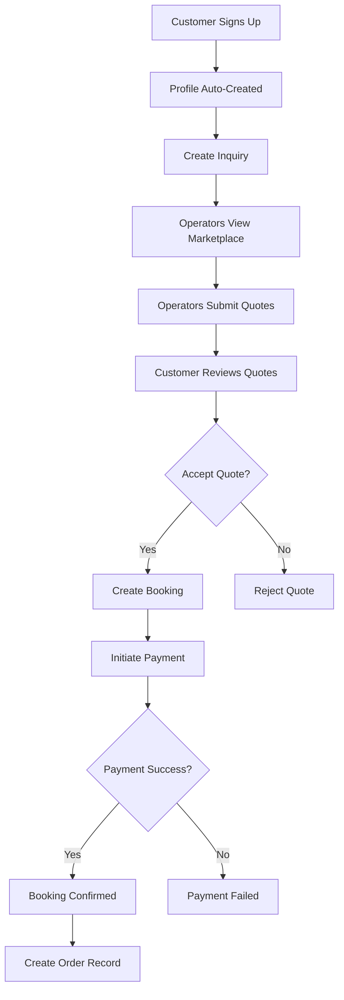
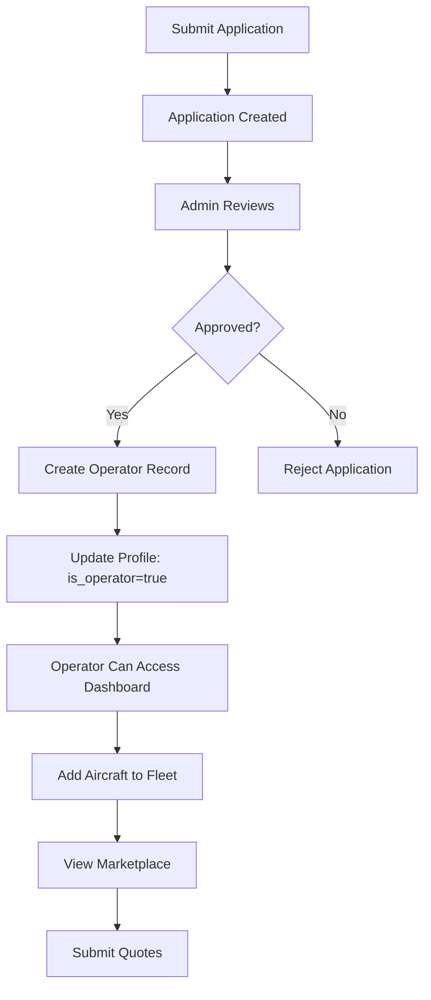
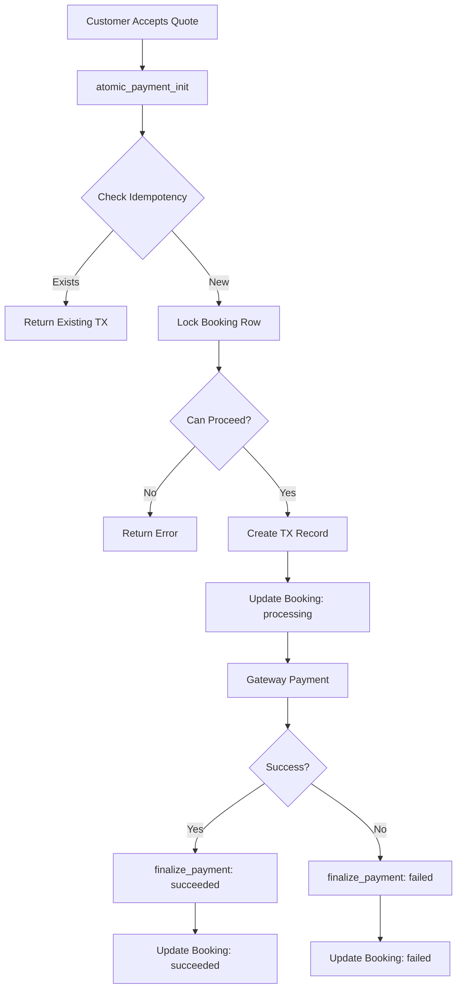

# Database Schema Diagram

## Entity Relationship Overview

```mermaid
erDiagram
    AUTH_USERS ||--|| PROFILES : extends
    PROFILES ||--o{ OPERATORS : "via email/user_id"
    PROFILES ||--o{ INQUIRIES : creates
    PROFILES ||--o{ DOCUMENTS : uploads
    
    OPERATORS ||--o{ AIRCRAFT : owns
    OPERATORS ||--o{ OPERATOR_DOCUMENTS : maintains
    OPERATORS ||--o| OPERATOR_APPLICATIONS : "approved from"
    OPERATORS ||--o{ QUOTES : submits
    
    INQUIRIES ||--o{ QUOTES : receives
    
    QUOTES ||--o| BOOKINGS : "accepted to"
    QUOTES ||--o{ TRANSACTIONS : "payment for"
    
    BOOKINGS ||--o| ORDERS : generates
    
    AUDIT_LOGS }o--|| PROFILES : tracks

    AUTH_USERS {
        uuid id PK
        string email
        jsonb raw_user_meta_data
        timestamp created_at
    }

    PROFILES {
        uuid id PK FK
        string email
        string first_name
        string last_name
        string role
        boolean is_operator
        string operator_status
        timestamp banned_until
    }

    OPERATOR_APPLICATIONS {
        uuid id PK
        uuid user_id FK
        string company_name
        string email
        string status
        jsonb details
        timestamp created_at
    }

    OPERATORS {
        uuid id PK
        uuid application_id FK
        uuid user_id FK
        string name
        string email
        string status
        int aircraft_count
        decimal rating
    }

    AIRCRAFT {
        uuid id PK
        uuid operator_id FK
        string registration
        string model
        string type
        int seats
        string status
    }

    INQUIRIES {
        uuid id PK
        uuid customer_id FK
        uuid operator_id FK
        string from_airport
        string to_airport
        timestamp departure_datetime
        string status
    }

    QUOTES {
        uuid id PK
        uuid inquiry_id FK
        uuid operator_id FK
        string aircraft_model
        decimal total_price
        string status
        jsonb features
    }

    BOOKINGS {
        uuid id PK
        string booking_reference
        uuid quote_id FK
        uuid customer_id FK
        uuid operator_id FK
        string status
        string payment_status
        decimal total_amount
    }

    ORDERS {
        uuid id PK
        string order_reference
        uuid customer_id FK
        uuid booking_id FK
        uuid quote_id FK
        string status
        decimal total_amount
    }

    TRANSACTIONS {
        uuid id PK
        uuid quote_id FK
        uuid user_id FK
        decimal amount
        string status
        string idempotency_key
        timestamp completed_at
    }

    DOCUMENTS {
        uuid id PK
        uuid user_id FK
        string document_type
        string file_name
        string status
    }

    OPERATOR_DOCUMENTS {
        uuid id PK
        uuid operator_id FK
        string document_type
        string status
        date expiry_date
    }

    AUDIT_LOGS {
        uuid id PK
        uuid user_id FK
        string actor
        string action
        string resource
        jsonb metadata
    }
```

## Data Flow Diagrams

### Customer Booking Flow



### Operator Onboarding Flow



### Payment Processing Flow



## Access Control Matrix

| Role | Profiles | Inquiries | Quotes | Bookings | Operators | Aircraft | Admin |
|------|----------|-----------|--------|----------|-----------|----------|-------|
| **Customer** | Own | Own | For own inquiries | Own | View active | - | - |
| **Operator** | Own | All marketplace | Own + All | Assigned | Own record | Own fleet | - |
| **Admin** | All | All | All | All | All | All | Full |

## Index Strategy

### Primary Indexes (Performance)

- **Dashboards**: `idx_inquiries_status_created`, `idx_bookings_operator_status`
- **Lookups**: `idx_operators_email`, `idx_bookings_reference`
- **Foreign Keys**: All foreign keys have indexes

### Partial Indexes (Optimization)

- **Active records**: `idx_operators_active WHERE status = 'Active'`
- **Processing payments**: `idx_transactions_status_processing WHERE status = 'processing'`
- **Expiring docs**: `idx_operator_documents_expiry WHERE expiry_date IS NOT NULL`

### Unique Indexes (Integrity)

- **Idempotency**: `idx_transactions_idempotency_unique` - Prevent duplicate payments
- **One success per quote**: `idx_transactions_quote_succeeded_unique` - Prevent double charging

## Status Workflows

### Inquiry Status
```
New → Open → Quoted → Booked → Closed
                   └→ Cancelled
```

### Quote Status
```
Pending → Accepted → (creates Booking)
       └→ Rejected
```

### Booking Status
```
Confirmed → In-Flight → Completed
         └→ Cancelled
```

### Payment Status
```
not_started → processing → succeeded
                        └→ failed → (can retry)
                        └→ refunded
```

### Operator Application Status
```
Applied → Under Review → Approved → (creates Operator)
                      └→ Rejected
```

## Security Layers

1. **Authentication**: Supabase Auth (JWT tokens)
2. **Row Level Security (RLS)**: PostgreSQL policies on every table
3. **Role Checks**: Profile.role determines access level
4. **Operator Verification**: is_operator flag + operator_status
5. **Audit Logging**: All critical actions logged
6. **Session Management**: Ban mechanism for security

---

**Diagram Version**: 2.0  
**Last Updated**: 2025-12-30
